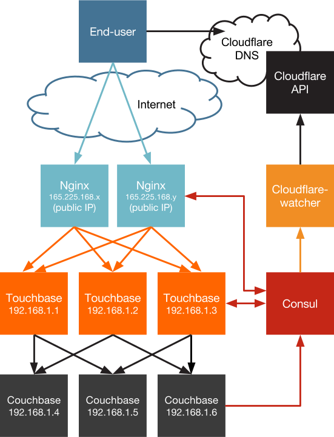

Touchbase autopilot pattern
==========

*[Autopilot pattern](http://autopilot.io/) implementation of [Touchbase](https://github.com/couchbaselabs/touchbase)*

This repo is a demonstration of a multi-tier application with Node.js, Couchbase, and Nginx, designed to be self-operating according to the [autopilot pattern](http://autopilot.io/). This application also demonstrates [Triton](https://joyent.com/) Container Name Service, an automated DNS that makes it easy to address Docker containers on the internet.

Specific components:

- [Touchbase](https://www.joyent.com/blog/docker-nodejs-nginx-nosql-autopilot#touchbase), a Node.js application
- [Nginx](https://www.joyent.com/blog/docker-nodejs-nginx-nosql-autopilot#nginx), acting as a load balancer for Touchbase nodes
- [Couchbase](https://www.joyent.com/blog/docker-nodejs-nginx-nosql-autopilot#couchbase), for the data tier
- [Consul](https://www.consul.io), acting as a service catalog to support discovery
- [ContainerPilot](http://joyent.com/containerpilot), to help with service discovery
- [Triton](https://www.joyent.com/), Joyent's container-native infrastructure platform
- [Triton CNS](https://www.joyent.com/blog/introducing-triton-container-name-service), the automated DNS on Triton



### Running the example

You can run this entire stack using the [`start.sh` script](https://github.com/tgross/triton-touchbase/blob/master/start.sh) found at the top of the repo.

Once you're ready:

1. [Get a Joyent account](https://my.joyent.com/landing/signup/) and [add your SSH key](https://docs.joyent.com/public-cloud/getting-started).
1. Install the [Docker Toolbox](https://docs.docker.com/installation/mac/) (including `docker` and `docker-compose`) on your laptop or other environment, as well as the [Joyent Triton CLI](https://www.joyent.com/blog/introducing-the-triton-command-line-tool) (`triton` replaces our old `sdc-*` CLI tools)
1. [Configure Docker and Docker Compose for use with Joyent](https://docs.joyent.com/public-cloud/api-access/docker):

```bash
curl -O https://raw.githubusercontent.com/joyent/sdc-docker/master/tools/sdc-docker-setup.sh && chmod +x sdc-docker-setup.sh
./sdc-docker-setup.sh -k us-east-1.api.joyent.com <ACCOUNT> ~/.ssh/<PRIVATE_KEY_FILE>
```


At this point you can run the example on Triton:

```bash
./start.sh env
# here you'll be asked to fill in the _env file
./start.sh
```

Use the `docker-compose-local.yml` to run the application in a local Docker environment (note that you may need to increase the memory available to your Docker Machine VM to run the full-scale cluster):

```bash
./start.sh env
./start.sh -f docker-compose-local.yml
```

The `_env` file that's created can optionally be filled in with the values described below. Note that the Couchbase password must meet [Couchbase's password requirements](http://docs.couchbase.com/admin/admin/security/security-inside-server.html), including a minimum length of seven (7) characters.

```
COUCHBASE_USER=<the administrative user you want for your Couchbase cluster>
COUCHBASE_PASS=<the password you want for that Couchbase user>
```

As the `start.sh` script runs, it will launch the Consul and Couchbase web UIs. Once Nginx is running, it will launch the login page for the Touchbase site. At this point there is only one Couchbase node, one application server and one Nginx server and you will see the message:

```
Touchbase cluster is launched!
Try scaling it up by running: ./start.sh scale
```

If you do so you'll be running `docker-compose scale` operations that add 2 more Couchbase and Touchbase nodes and 1 more Nginx node. You can watch as nodes become live by checking out the Consul and Couchbase web UIs.

If running this on Triton with an account enabled for Triton CNS, you'll see the generated DNS names for the container services in your browser's URL bar. Simply CNAME your own domain to that generated DNS name for the `tb-nginx` service, and you can make the application public. [Learn more about Triton CNS at Joyent.com](https://www.joyent.com/blog/introducing-triton-container-name-service).
